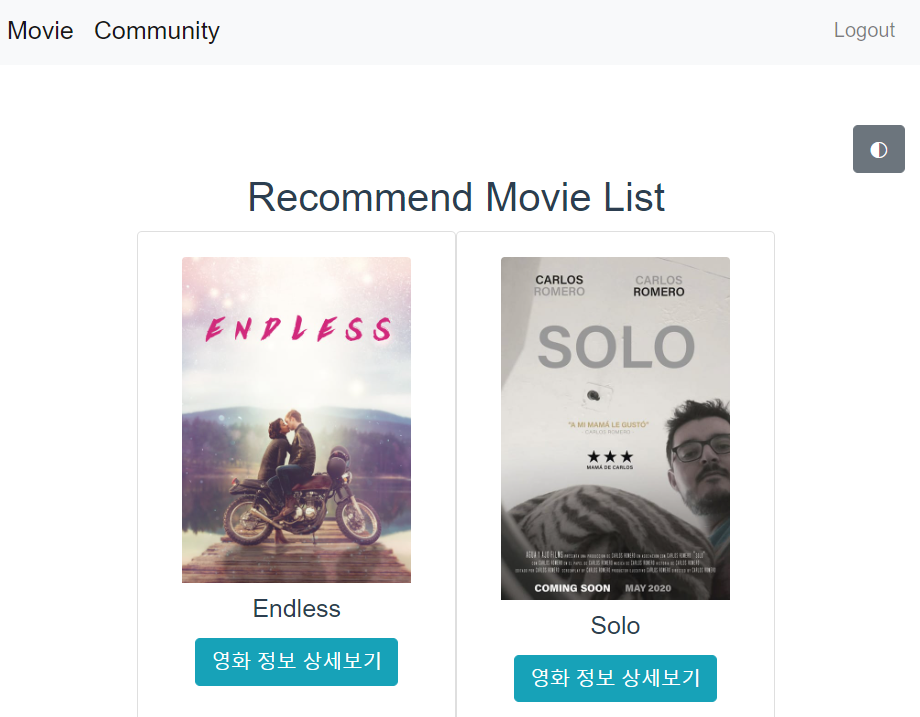

# 종합 프로젝트


## 1. 팀원 정보 및 업무 분담 내역

- 팀장 : 박 인 남

- 팀원 : 길 민 규

- 업무 분담 내역

  frontend-길민규, backend-박인남

  

  

## 2. 목표 서비스 구현 및 실제 구현 정도

- 목표 : 영화 API를 이용한 보다 향상된 편의성을 제공하는 영화 추천 서비스 및 Community 기능 구현 

| 대상      | 구현 정도                                                    |
| --------- | ------------------------------------------------------------ |
| Movie     | 사용자가 영화 리스트 탐색 및 디테일 확인, 어드민 페이지를 통해 관리자만 생성,수정,삭제 |
| Article   | 인증된 사용자만 게시글 리스트에 접근 및 조회, 인증된 사용자만 생성, 삭제, 수정 |
| Comment   | 인증된 사용자만 게시글에서 댓글 확인, 인증된 사용자만 게시글에 댓글 생성, 삭제, 수정 |
| User      | 회원가입, 로그인, 로그아웃, 어드민 페이지를 통해 관리자만 생성,수정,삭제 |
| Rating    | 인증된 사용자만 무비 디테일 페이지에서 생성 수정 삭제, 생성시 서버에 반영되어 영화 추천을 위한 파라미터가 됨 |
| Genre     | 어드민 페이지를 통해 관리자만 생성,수정,삭제                 |
| 추가 기능 | 아티클 작성시에 영화 제목 입력란에 텍스트를 입력하면 추천 검색어를 리스트로 보여줌<br />아티클과 무비 리스트 탐색 시에 페이지네이션을 통해 한번에 일정량만 확인<br />모든 페이지에서 다크모드 버튼을 통해 다크모드 전환/해제<br /> 무비 리스트 페이지에서 브라우저의 넓이가 575px 이하가 되면 영화 추천리스트는 영화의 타이틀만을 표기하는 것으로 바뀌고 우측 하단에 최상위로 스크롤하는 버튼이 보임 |


## 3. 데이터베이스 모델링(ERD)


## 4. 필수 기능

1. 관리자 권한의 유저만 영화 등록 / 수정 / 삭제 권한을 가집니다.


2. 관리자 권한의 유저만 유저 관리 권한을 가집니다.


3. 영화 정보는 Database Seeding을 활용해 최소 50개 이상의 데이터가 존재하도록 구성해야 합니다.


- tmdb api를 활용하여 현재 상영중인 500개의 영화를 저장


4. 추천 알고리즘의 지정된 형식은 없으나, 사용자는 반드시 최소 1개 이상의 방식으로 영화를 추천 받을 수 있어야 합니다.

```
인증되지 않은 사용자에게는 영화 추천이 제공되지 않습니다.
인증된 사용자에게는 어떠한 영화에도 평점을 부여하지 않았을 경우엔 보유하고 있는 Movie API Data에서 평점이 높은 순으로 제공되며,
일부 영화에 평점을 부여하였을 경우, 해당 영화의 장르를 count하여 count된 장르의 갯수가 가장 많은 장르에서 랜덤으로 영화를 추천합니다.
```




5. 영화 정보와 관련된 대화를 할 수 있는 커뮤니티 기능을 구현해야 합니다.


6. 로그인한 사용자만 글을 조회 / 생성 할 수 있으며 작성자 본인만 글을 수정 / 삭제 할 수 있습니다.


```
<좌> 로그인 하지 않았을 때 게시글을 조회 불가능
<우> 로그인을 한 사용자는 게시글을 조회 가능
```


```
<좌> 작성자 본인의 게시글을 조회하였을 때 (수정 및 삭제 가능)
<우> 작성자 본인의 게시글이 아닌 글을 조회하였을 때 (수정 및 삭제 불가능)
```


7. 사용자는 작성된 게시글에 댓글을 작성할 수 있어야 하며 작성자 본인만 댓글을 삭제 할 수 있습니다. 각 게시글 및 댓글은 생성 및 수정 시각 정보가 포함되어야 합니다.


```
댓글은 본인이 작성한 글만 수정 및 삭제가 가능하며, 6번과 7번 기능에서 확인할 수 있듯이 게시글엔 각각 게시글 작성 시간과 수정시간, 댓글엔 작성시간과 수정을 거치면 수정시간으로 새로 업데이트됩니다.
```


##### 8. 다양한 추가 기능을 구성할 수 있습니다.

1. 아티클 생성 시 영화 제목 자동완성 기능


2. 페이지네이션


```
<좌> Movie Page에서의 Pagination
<우> Article Page에서의 Pagination
```

3. 모바일 뷰 및 최상위 scroll 버튼


```
Mobile view를 고려한 Recommend List 간소화 및 Scroll Top Button 구현
```

4. 다크모드


```
<Dark Mode> 활성화 구현 기능
```


## 5. 배포서버 URL

- front : https://inmin.netlify.app/
- back : http://inmin.herokuapp.com/

## 6. 기타 (느낀점)

- 기타 참고

  - 서버 요청 url

  | HTTP Methods | url                          | 기능                                           | 기타                                      |
  | ------------ | ---------------------------- | ---------------------------------------------- | ----------------------------------------- |
  | post         | /rest-auth/signup/           | 회원가입                                       |                                           |
  | post         | /rest-auth/login/            | 로그인                                         | 토큰                                      |
  | post         | /rest-auth/logout/           | 로그아웃                                       | 로그인 필요                               |
  | put          | /accounts/12/                | 12번 유저 수정                                 | 본인, 관리자만                            |
  | delete       | /accounts/12/                | 12번 유저 삭제                                 | 본인, 관리자만                            |
  | get          | /articles/?page=3            | 게시글 목록 3 페이지 조회                      | 로그인 필요 / default: page=1             |
  | post         | /articles/                   | 게시글 생성                                    | 로그인 필요                               |
  | get          | /articles/12/                | 12번 게시글 조회                               | 로그인 필요                               |
  | put          | /articles/12/                | 12번 게시글 수정                               | 본인만 / title,content 필요               |
  | delete       | /articles/12/                | 12번 게시글 삭제                               | 본인만                                    |
  | get          | /articles/12/user            | 지금 요청한 유저가 12번글의 작성자인지 확인    | 로그인 필요/{status:OK/FAIL}              |
  | get          | /articles/12/comments/       | 12번글 댓글 조회                               | 로그인 필요                               |
  | post         | /articles/12/comments/       | 12번글 댓글 생성                               | 로그인 필요                               |
  | put          | /articles/12/comments/2/     | 12번글 2번째 댓글 수정                         | 로그인 필요 / content 필요                |
  | delete       | /articles/12/comments/2/     | 12번글 2번째 댓글 삭제                         | 로그인 필요                               |
  | get          | /articles/12/comments/2/user | 지금 요청한 유저가 12번 댓글의 작성자인지 확인 | 로그인 필요/{status:OK/FAIL}              |
  | get          | /articles/count/             | 게시글 총 페이지 조회                          | 로그인 필요                               |
  | get          | /movies/?page=3              | 영화 리스트 3페이지 조회                       | default: page=1                           |
  | post         | /movies/                     | 영화 생성                                      | 어드민만                                  |
  | get          | /movies/12/                  | 12번 영화 조회                                 |                                           |
  | put          | /movies/12/                  | 12번 영화 수정                                 | 어드민만                                  |
  | delete       | /movies/12/                  | 12번 영화 삭제                                 | 어드민만                                  |
  | get          | /movies/12/rate/             | 유저가 이전에 작성한 포인트 조회               | 로그인 필요 / {status:OK/FAIL,point:0~10} |
  | post         | /movies/12/rate/             | 12번 영회에 평점 작성/수정                     | 로그인 필요 / point 필요(0~10)            |
  | delete       | /movies/12/rate/             | 12번 영회에 평점 삭제                          | 로그인 필요                               |
  | get          | /movies/recommand/           | 영화 추천                                      | 로그인 필요                               |
  | get          | /movies/search/              | 자동완성을 위한 id, title                      | 로그인 필요                               |
  | get          | /movies/count/               | 영화 총 페이지 조회                            |                                           |

  - 데이터시딩

    ```shell
    # shell plus
    Genre.get_genre() # 장르데이터 가져오기
    Movie.get_movie() # 영화데이터 가져오기
    Article.dummy(n) # 게시글 n개 생성
    ```


```
짧은 시간동안 backend 와 frontend에 대해서 배웠지만, frontend쪽을 더 잘 이해하고 따라갔다고 생각했습니다. 그러나 backend쪽에서의 미흡한점과 이번 프로젝트가 두 part모두 사용된다는점이 훗날 web 개발자가 되기 위해선 두 part 모두 균형을 이뤄야한다는것을 느꼈습니다. back이 미흡하다보니 front를 진행할 때 많은 어려움이 있었습니다. 이번 기회에 django를 다시 복기하며 back, front의 균형을 맞추고, 더 나아갈 수 있도록 하겠습니다.
```


