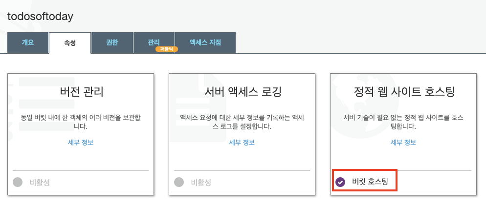

# Vue

> Vue 배포


## 준비

### 0. build

- 배포용 빌드 파일 생성

```shell
npm run build
```


## aws S3

### 0. 버킷 생성

- 버킷 만들기 버튼 클릭


- 이후 페이지에서는 모두 다음 눌러서 진행


- 생성된 버킷 확인


### 1. 속성변경

- 속성 탭에서 정적 웹 사이트 호스팅 옵션 클릭


- 인덱스 문서 (default는 index.html) 작성 후 저장
  - 엔드포인트가 바로 Vue가 배포된 도메인 주소이므로 확인!


- 버킷 호스팅 활성화 확인




### 2. 파일 업로드

- 개요 탭에서 업로드 버튼 클릭


- 드래그 앤 드랍으로 `dist` 폴더 안의 파일들 올리기


- 이후 페이지부터는 다음 으로 계속 진행 후 최종 업로드 버튼 누르면 완료!

- dist 폴더 안의 파일들이 잘 올라갔는지 확인


- 엔드포인트 접속 후 403 Forbidden 확인


### 3. 권한설정

- 권한 탭에서 퍼블릭 액세스 차단에서 편집 클릭


- 모든 퍼블릭 액세스 차단 클릭 해제 후 저장


- 확인 메세지에 확인 입력후 진행


### 4. 정책추가

- 버킷 정책 탭에서 정책 생성기 클릭 후 아래와 같이 작성


- Add Statement 버튼 클릭

- Generate policy 버튼 클릭후 뜨는 팝업창 내용 복사!


- 주의!! Resource 속성 값 맨 뒤에 /* 추가해줄 것!

```
{
  "Id": "Policy1591493465483",
  "Version": "2012-10-17",
  "Statement": [
    {
      "Sid": "Stmt1591493460587",
      "Action": [
        "s3:GetObject"
      ],
      "Effect": "Allow",
      "Resource": "arn:aws:s3:::todosoftoday/*",
      "Principal": "*"
    }
  ]
}

```


- 버킷 권한 내 버킷 정책 탭에서 위에서 생성한 내용 붙여넣기 후 저장


- 위에서 봤던 엔드포인트를 통해 브라우저에서 접속해보면 정상적으로 배포가 돼있는 것을 확인할 수 있다.


## Django + Vue

> Vue에서는 API의 요청 주소를 EC2 endpoint 주소로 바꿔주고, 
> Django에서는 CORS whitelist에 Vue의 S3 endpoint를 추가해줍니다.